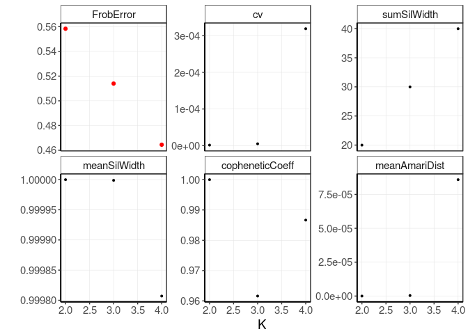
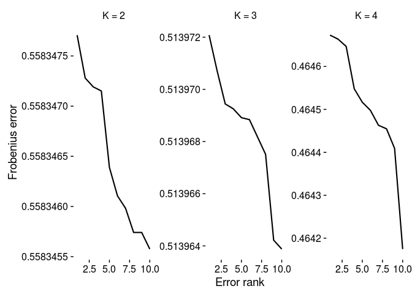

# Bratwurst
Daniel Huebschmann & Sebastian Steinhauser  
20.07.2016  

`Bratwurst` is a software package providing functions for preprocessing,
wrappers for non-negative matrix factorization and postprocessing in `R`. This 
repo hosts the code of the Bratwurst software package.  
A detailed description 
of the software and an application to cells of the human hematopoietic system 
are available as a preprint: https://doi.org/10.1101/199547.  
Intermediate results for the analysis on hematopoietic cells are available on
zenodo: https://doi.org/10.5281/zenodo.800049.
  

```r
library(BiocStyle)
library(knitr)
library(ComplexHeatmap)
```

# Introduction

**NMF** (**nonnegative matrix factorization**) is a matrix decomposition 
method. It was originally described by Lee & Seung in 1999. In 2003, Brunet et 
al. applied NMF to gene expression data. In 2010, *[NMF](http://cran.fhcrc.org/web/packages/NMF/index.html)*, an R 
package implementing several NMF solvers was published by Gaujoux et al.
NMF basically solves the problem as illustrated in the following figure
(Image taken from 
<https://en.wikipedia.org/wiki/Non-negative_matrix_factorization>):


Here, `V` is an input matrix with dimensions `n x m`. It is decomposed
into two matrices `W` of dimension `n x l` and `H` of dimension
`l x m`, which when multiplied approximate the original matrix `V`. `l` is
a free parameter in NMF, it is called the factorization rank. If we call the 
columns of `W` signatures, then `l` corresponds to the number of 
signatures. The decomposition thus leads to a reduction in complexity if 
`l < n`, i.e. if the number of signatures is smaller than the number of 
features, as indicated in the above figure.

In 2015, Mejia-Roa et al. introduced an implementation of an NMF-solver in 
CUDA, which lead to significant reduction of computation times by making use of
massive parallelisation on GPUs. Other implementations of
NMF-solvers on GPUs exist.

It is the pupose of the package `Bratwurst` described here to provide wrapper 
functions in R to these NMF-solvers in CUDA. Massive parallelisation not only 
leads to faster algorithms, but also makes the benefits of NMF accessible to 
much bigger matrices. Furthermore, functions for preprocessing, estimation of
the optimal factorization rank and post-hoc feature selection are provided.

# The Bratwurst package 

The main feature of the package `Bratwurst` is an S4 object called `nmf.exp`. 
It is derived from `SummarizedExperiment`, has containers for a data matrix, 
column annotation data and row annotation data and inherits 
`SummarizedExperiment`'s accessor functions `colData` and `rowData`. The matrix
to be stored in this data structure is the matrix V as described above, 
corresponding to the input matrix for the NMF-solver. `nmf.exp` furthermore has
containers for the matrices W and H which are results of the decomposition.
As NMF algorithms have to be run iteratively, an instance of the class 
`nmf.exp` can store large lists of matrices, corresponding to the results of 
different iteration steps. Accessor functions to all different containers are 
provided.

A crucial step in data analysis with NMF is the determination of the optimal 
factorization rank, i.e. the number of columns of the matrix W or 
equivalently the number of rows of the matrix H. No consensus method for an 
automatic evaluation of the optimal factorization rank has been found to date. 
Instead, the decomposition is usually performed iteratively over a range of 
possible factorization ranks and different quality measures are computed for 
every tested factorization ranks. Many quality measures have been proposed:

* The `Frobenius reconstruction error`, i.e. the Frobenius norm of the 
residuals of the decomposition: ||W x H - V||
* Criteria to assess the stability of the decomposition:

  + The `cophenetic correlation coefficient`
  + An `Amari type distance`
  + `Silhouette values` over clusters of patterns extracted iteratively at the 
  same factorization rank

The package `Bratwurst` provides functions to compute all 

# Example: leukemia data

Preparations


```r
library(Bratwurst)
library(NMF)
```

Load the example data


```r
data(leukemia)
samples <- "leukemia"
```

This data was initially generated by the following commands:


```r
data.path  <- file.path(getwd(), "data")
matrix.file <- list.files(data.path, "*data.txt", full.names = T)
rowAnno.file <- list.files(data.path, "micro.*anno.*txt", full.names = T)
rowAnno.bed <- list.files(data.path, ".bed", full.names = T)
colAnno.file <- list.files(data.path, "sample.*anno.*txt", full.names = T)
# Read files to summarizedExperiment
leukemia.nmf.exp <- nmfExperimentFromFile(matrix.file = matrix.file,
                                          rowAnno.file = rowAnno.file,
                                          colData.file = colAnno.file)
save(leukemia.nmf.exp, file = file.path(data.path, "leukemia.rda"))
```

Now we are ready to start an NMF analysis.

## NMF analysis

### Call wrapper function

The wrapper function for the NMF solvers in the Bratwurst package is 
`runNmfGpu`. It is called as follows:


```r
k.max <- 4
outer.iter <- 10
inner.iter <- 10^4

leukemia.nmf.exp<- runNmfGpuPyCuda(nmf.exp = leukemia.nmf.exp,
                                   k.max = k.max,
                                   outer.iter = outer.iter,
                                   inner.iter = inner.iter,
                                   tmp.path = "/tmp/tmp_leukemia",
                                   cpu = TRUE)
```

```
## [1] "2017-10-09 10:40:52 CEST"
## Factorization rank:  2 
## [1] "2017-10-09 10:41:07 CEST"
## Factorization rank:  3 
## [1] "2017-10-09 10:41:26 CEST"
## Factorization rank:  4
```

Depending on the choice of parameters (dimensions of the input matrix, number 
of iterations), this step may take some time. Note that the algorithm updates 
the user about the progress in the iterations.

Several getter functions are available to access the data in the generated 
`nmf.exp` object:

### `HMatrixList` 

Returns a list of matrices `H` for a specific factorization 
rank `k`. There are as many entries in this list as there were iterations in
the outer iteration. Of course the number of rows of the matrix `H` corresponds
to the chosen factorization rank.


```r
tmp.object <- HMatrixList(leukemia.nmf.exp, k = 2)
class(tmp.object)
```

```
## [1] "list"
```

```r
length(tmp.object)
```

```
## [1] 10
```

```r
class(tmp.object[[1]])
```

```
## [1] "matrix"
```

```r
dim(tmp.object[[1]])
```

```
## [1]  2 38
```

```r
kable(as.data.frame(tmp.object[[1]][, c(1:5)]))
```

    X19769      X23953      X28373       X9335       X9692
----------  ----------  ----------  ----------  ----------
 0.0012217   0.0006957   0.0017320   0.0009911   0.0023145
 0.0101117   0.0092702   0.0100455   0.0090467   0.0079003

If no value for `k` is supplied, the function returns a list of lists, one for
every iterated factorization rank.


```r
tmp.object <- HMatrixList(leukemia.nmf.exp)
class(tmp.object)
```

```
## [1] "list"
```

```r
length(tmp.object)
```

```
## [1] 3
```

```r
class(tmp.object[[1]])
```

```
## [1] "list"
```

```r
length(tmp.object[[1]])
```

```
## [1] 10
```

### `HMatrix` 

Returns the matrix `H` for the optimal decomposition (i.e. the one 
with the minimal residual) for a specific factorization rank `k`. As in the 
previous paragraph, the number of rows of the matrix `H` corresponds to the 
chosen factorization rank.


```r
tmp.object <- HMatrix(leukemia.nmf.exp, k = 2)
class(tmp.object)
```

```
## [1] "matrix"
```

```r
dim(tmp.object)
```

```
## [1]  2 38
```

```r
kable(tmp.object[, c(1:5)])
```

    X19769      X23953      X28373       X9335       X9692
----------  ----------  ----------  ----------  ----------
 0.0011684   0.0006634   0.0016600   0.0009470   0.0022194
 0.0103269   0.0094676   0.0102585   0.0092395   0.0080685

If no value for `k` is supplied, the function returns a list of optimal 
matrices, one for every iterated factorization rank.


```r
H.list <- HMatrix(leukemia.nmf.exp)
class(H.list)
```

```
## [1] "list"
```

```r
length(H.list)
```

```
## [1] 3
```

```r
kable(H.list[[1]][, c(1:5)])
```

    X19769      X23953      X28373       X9335       X9692
----------  ----------  ----------  ----------  ----------
 0.0011684   0.0006634   0.0016600   0.0009470   0.0022194
 0.0103269   0.0094676   0.0102585   0.0092395   0.0080685

### `WMatrixList` 

Returns a list of matrices `W` for a specific factorization 
rank `k`. There are as many entries in this list as there were iterations in
the outer iteration. Of course the number of columns of the matrix `W` 
corresponds to the chosen factorization rank.


```r
tmp.object <- WMatrixList(leukemia.nmf.exp, k = 2)
class(tmp.object)
```

```
## [1] "list"
```

```r
length(tmp.object)
```

```
## [1] 10
```

```r
class(tmp.object[[1]])
```

```
## [1] "matrix"
```

```r
dim(tmp.object[[1]])
```

```
## [1] 4951    2
```

```r
kable(as.data.frame(tmp.object[[1]][c(1:5), ]))
```

        V1          V2
----------  ----------
 17466.253   24780.637
  1325.366    5232.173
 21145.189   27374.652
  2609.515    3935.618
  3984.408    5466.515

If no value for `k` is supplied, the function returns a list of lists, one for
every iterated factorization rank.

### `WMatrix`

Returns the matrix `W` for the optimal decomposition (i.e. the one 
with the minimal residual) for a specific factorization rank `k`. As in the 
previous paragraph, the number of columns of the matrix `W` corresponds to the 
chosen factorization rank.


```r
tmp.object <- WMatrix(leukemia.nmf.exp, k = 2)
class(tmp.object)
```

```
## [1] "matrix"
```

```r
dim(tmp.object)
```

```
## [1] 4951    2
```

```r
kable(as.data.frame(tmp.object[c(1:5), ]))
```

        V1          V2
----------  ----------
 18178.421   24274.787
  1379.526    5124.079
 22009.461   26815.369
  2716.068    3855.091
  4147.238    5354.742

If no value for `k` is supplied, the function returns a list of optimal 
matrices, one for every iterated factorization rank.


```r
W.list <- WMatrix(leukemia.nmf.exp)
class(W.list)
```

```
## [1] "list"
```

```r
length(W.list)
```

```
## [1] 3
```

```r
kable(as.data.frame(W.list[[1]][c(1:5), ]))
```

        V1          V2
----------  ----------
 18178.421   24274.787
  1379.526    5124.079
 22009.461   26815.369
  2716.068    3855.091
  4147.238    5354.742


### `FrobError`

Returns a data frame with as many columns as there are iterated factorization 
ranks and as many rows as there are iterations per factorization rank.


```r
kable(FrobError(leukemia.nmf.exp))
```

         2           3           4
----------  ----------  ----------
 0.5583464   0.5139642   0.4641748
 0.5583473   0.5139693   0.4644978
 0.5583461   0.5139688   0.4646465
 0.5583477   0.5139639   0.4644630
 0.5583457   0.5139707   0.4645478
 0.5583460   0.5139682   0.4644090
 0.5583472   0.5139721   0.4644547
 0.5583457   0.5139675   0.4646729
 0.5583472   0.5139689   0.4645166
 0.5583456   0.5139694   0.4646634

## Determine the optimal factorization rank

In NMF, Several methods have been described to assess the optimal factorization
rank. The Bratwurst packages implements some of them. They are computed by 
applying custom functions which subsequently update the data structure of type
`nmf.exp`.

### Get Frobenius error.

The most important information about the many iterated decompositions is the
norm of the residual. In NMF this is often called the Frobenius error, as the
Frobenius norm may be used.


```r
leukemia.nmf.exp <- computeFrobErrorStats(leukemia.nmf.exp)
```

### Generate Alexandrov Criterion plot

In [@Alex2013] an approach is described in which a modified silhouette 
criterion is used to estimate the stability across iteration steps for one 
fixed factorization rank `k`.


```r
leukemia.nmf.exp <- computeSilhoutteWidth(leukemia.nmf.exp)
```

### Cophenetic correlation coefficient plot


```r
leukemia.nmf.exp <- computeCopheneticCoeff(leukemia.nmf.exp)
```

### Compute amari type distance


```r
leukemia.nmf.exp <- computeAmariDistances(leukemia.nmf.exp)
```

After having executed all these functions, the values of the computed measures
can be accessed with `OptKStats`:


```r
kable(OptKStats(leukemia.nmf.exp))
```

       k         min        mean          sd          cv   sumSilWidth   meanSilWidth   copheneticCoeff   meanAmariDist
---  ---  ----------  ----------  ----------  ----------  ------------  -------------  ----------------  --------------
2      2   0.5583456   0.5583465   0.0000008   0.0000014      20.00000      0.9999999         0.9999999        0.00e+00
3      3   0.5139639   0.5139683   0.0000026   0.0000050      29.99996      0.9999988         0.9616090        4.00e-07
4      4   0.4641748   0.4645046   0.0001483   0.0003192      39.99228      0.9998071         0.9866591        8.59e-05

These quality measures can be displayed together:

### Generate plots to estimate optimal k


```r
gg.optK <- plotKStats(leukemia.nmf.exp)
gg.optK
```



### Generate ranked error plot.

It may also be useful to inspect the Frobenius error after ranking. This may 
give an estimation of the convergence in the parameter space of initial 
conditions.


```r
gg.rankedFrobError <- plotRankedFrobErrors(leukemia.nmf.exp)
```

```
## Warning: `legend.margin` must be specified using `margin()`. For the old
## behavior use legend.spacing
```

```r
gg.rankedFrobError
```




## Visualize the matrix H (exposures)

The matrices `H` may be visualized as heatmaps. We can define a meta
information object and annotate meta data:


```r
entity.colVector <- c("red", "blue")
names(entity.colVector) <- c("ALL", "AML")
subtype.colVector <- c("orange", "darkgreen", "blue")
names(subtype.colVector) <- c("B-cell", "T-cell", "-")
anno_col <- list(V2 = entity.colVector,
                 V3 = subtype.colVector)
heat.anno <- HeatmapAnnotation(df = colData(leukemia.nmf.exp)[, c(2:3)],
                               col = anno_col)
```

And now display the matrices `H` with meta data annotation:


```r
# sapply(1:length(HMatrix(leukemia.nmf.exp)), function(i) {
#   current_k <- as.numeric(names(HMatrix(leukemia.nmf.exp))[i])
#   h.heatmap <- Heatmap(HMatrix(leukemia.nmf.exp, k = current_k),
#                        clustering_distance_columns = "pearson",
#                        heatmap_legend_param = list(color_bar = "continuous"),
#                        show_column_names = F, cluster_rows = F,
#                        top_annotation = heat.anno)
#   draw(h.heatmap)
# })
```

Bratwurst provides a plotting function to display the matrices `H` with meta data annotation:


```r
# Plot Heatmaps for H over all k
lapply(seq(2, k.max), function(k) {
  plotHMatrix(leukemia.nmf.exp, k)
})
```

```
## [[1]]
```


```
## 
## [[2]]
```


```
## 
## [[3]]
```


## Feature selection 
### Row K-means to determine signature specific features


```r
### Find representative regions.
# Get W for best K
leukemia.nmf.exp <- setOptK(leukemia.nmf.exp, 4)
OptK(leukemia.nmf.exp)
```

```
## [1] 4
```

```r
signature.names <- getSignatureNames(leukemia.nmf.exp, OptK(leukemia.nmf.exp))
signature.names
```

```
## [1] "ALL B-cell 0.64\nAML - 0.36" "AML -"                      
## [3] "ALL T-cell"                  "ALL B-cell"
```

```r
FeatureStats(leukemia.nmf.exp)
```

```
## DataFrame with 0 rows and 0 columns
```

```r
leukemia.nmf.exp <- computeFeatureStats(leukemia.nmf.exp)
FeatureStats(leukemia.nmf.exp)
```

```
## DataFrame with 4951 rows and 7 columns
##          cluster deltaCenters  deltaMean explainedVar    oddsVar   coefVar
##      <character>    <numeric>  <numeric>    <numeric>  <numeric> <numeric>
## 1           1000    0.5598768  40404.983    0.9290739 0.07634068 0.9366928
## 2           1011    0.3803309   2573.797    0.9388679 0.06511258 0.3902262
## 3           0101   -0.4294660 -24040.664    0.9588564 0.04290901 0.5927406
## 4           1000    0.5226433   5657.101    0.9607982 0.04080124 0.8355173
## 5           1100    0.2919822   3304.288    0.7907449 0.26463040 0.4499437
## ...          ...          ...        ...          ...        ...       ...
## 4947        1000    0.3247738  1558.5093    0.9386278 0.06538501 0.4453941
## 4948        1011    0.3931513 22919.0305    0.8101850 0.23428596 0.4533714
## 4949        1000    0.4427220 11509.2834    0.8894812 0.12425081 0.6686290
## 4950        1001    0.2278627   929.7619    0.7930793 0.26090794 0.3449582
## 4951        1011    0.4895291 13897.9083    0.7588860 0.31772096 0.6473873
##        meanSil
##      <numeric>
## 1    0.5842238
## 2    0.6015913
## 3    0.7912017
## 4    0.6246600
## 5    0.4495862
## ...        ...
## 4947 0.5933313
## 4948 0.4366444
## 4949 0.5301540
## 4950 0.4561943
## 4951 0.3617552
```

```r
# You might want to add additional selection features
# such as entropy or absolute delta 
# Entropy
leukemia.nmf.exp <- computeEntropy4OptK(leukemia.nmf.exp)
FeatureStats(leukemia.nmf.exp)
```

```
## DataFrame with 4951 rows and 8 columns
##          cluster deltaCenters  deltaMean explainedVar    oddsVar   coefVar
##      <character>    <numeric>  <numeric>    <numeric>  <numeric> <numeric>
## 1           1000    0.5598768  40404.983    0.9290739 0.07634068 0.9366928
## 2           1011    0.3803309   2573.797    0.9388679 0.06511258 0.3902262
## 3           0101   -0.4294660 -24040.664    0.9588564 0.04290901 0.5927406
## 4           1000    0.5226433   5657.101    0.9607982 0.04080124 0.8355173
## 5           1100    0.2919822   3304.288    0.7907449 0.26463040 0.4499437
## ...          ...          ...        ...          ...        ...       ...
## 4947        1000    0.3247738  1558.5093    0.9386278 0.06538501 0.4453941
## 4948        1011    0.3931513 22919.0305    0.8101850 0.23428596 0.4533714
## 4949        1000    0.4427220 11509.2834    0.8894812 0.12425081 0.6686290
## 4950        1001    0.2278627   929.7619    0.7930793 0.26090794 0.3449582
## 4951        1011    0.4895291 13897.9083    0.7588860 0.31772096 0.6473873
##        meanSil    entropy
##      <numeric>  <numeric>
## 1    0.5842238 0.41736287
## 2    0.6015913 0.09377805
## 3    0.7912017 0.19862689
## 4    0.6246600 0.32592530
## 5    0.4495862 0.10924133
## ...        ...        ...
## 4947 0.5933313 0.09745639
## 4948 0.4366444 0.12369820
## 4949 0.5301540 0.21847701
## 4950 0.4561943 0.06351516
## 4951 0.3617552 0.26069339
```

```r
leukemia.nmf.exp <- computeAbsDelta4OptK(leukemia.nmf.exp)
FeatureStats(leukemia.nmf.exp)
```

```
## DataFrame with 4951 rows and 12 columns
##          cluster deltaCenters  deltaMean explainedVar    oddsVar   coefVar
##      <character>    <numeric>  <numeric>    <numeric>  <numeric> <numeric>
## 1           1000    0.5598768  40404.983    0.9290739 0.07634068 0.9366928
## 2           1011    0.3803309   2573.797    0.9388679 0.06511258 0.3902262
## 3           0101   -0.4294660 -24040.664    0.9588564 0.04290901 0.5927406
## 4           1000    0.5226433   5657.101    0.9607982 0.04080124 0.8355173
## 5           1100    0.2919822   3304.288    0.7907449 0.26463040 0.4499437
## ...          ...          ...        ...          ...        ...       ...
## 4947        1000    0.3247738  1558.5093    0.9386278 0.06538501 0.4453941
## 4948        1011    0.3931513 22919.0305    0.8101850 0.23428596 0.4533714
## 4949        1000    0.4427220 11509.2834    0.8894812 0.12425081 0.6686290
## 4950        1001    0.2278627   929.7619    0.7930793 0.26090794 0.3449582
## 4951        1011    0.4895291 13897.9083    0.7588860 0.31772096 0.6473873
##        meanSil    entropy absDelta.V1 absDelta.V2 absDelta.V3 absDelta.V4
##      <numeric>  <numeric>   <numeric>   <numeric>   <numeric>   <numeric>
## 1    0.5842238 0.41736287   16700.196  -55929.744  -74379.973  -62019.591
## 2    0.6015913 0.09377805   -4424.995  -10895.600   -6643.628   -6175.400
## 3    0.7912017 0.19862689  -68083.015  -30868.132  -76178.055  -17230.281
## 4    0.6246600 0.32592530    1648.302   -8626.609  -10557.755   -9813.338
## 5    0.4495862 0.10924133   -4115.362   -8767.533  -14313.137  -11786.910
## ...        ...        ...         ...         ...         ...         ...
## 4947 0.5933313 0.09745639  -1224.0405   -4621.225   -4470.665   -3931.287
## 4948 0.4366444 0.12369820 -67440.3287  -93600.108  -39650.117  -36195.695
## 4949 0.5301540 0.21847701   -472.5316  -23193.018  -27132.367  -20147.910
## 4950 0.4561943 0.06351516  -3307.7331   -4171.742   -4835.147   -1980.109
## 4951 0.3617552 0.26069339  -7152.3087  -47534.210  -32293.208  -19769.663
```

### Feature visualization


```r
# Plot all possible signature combinations
plotSignatureFeatures(leukemia.nmf.exp)
```

```
## Warning: `legend.margin` must be specified using `margin()`. For the old
## behavior use legend.spacing

## Warning: `legend.margin` must be specified using `margin()`. For the old
## behavior use legend.spacing
```

```
## Warning: `panel.margin` is deprecated. Please use `panel.spacing` property
## instead
```


```r
# Plot only signature combinations
plotSignatureFeatures(leukemia.nmf.exp, sig.combs = F)
```

```
## Warning: `legend.margin` must be specified using `margin()`. For the old
## behavior use legend.spacing
```

```
## Warning: `legend.margin` must be specified using `margin()`. For the old
## behavior use legend.spacing
```

```
## Warning: `panel.margin` is deprecated. Please use `panel.spacing` property
## instead
```


```r
# Try to display selected features on W matrix
sig.id <- "1000"
m <- WMatrix(leukemia.nmf.exp, k = OptK(leukemia.nmf.exp))[
  FeatureStats(leukemia.nmf.exp)[, 1] == sig.id, ]
m <- m[order(m[, 1]), ]
c <- getColorMap(m)
#m <- t(apply(m, 1, function(r) (r - mean(r))/sd(r)))

Heatmap(m, col = c, cluster_rows = F, cluster_columns = F)
```


# References
